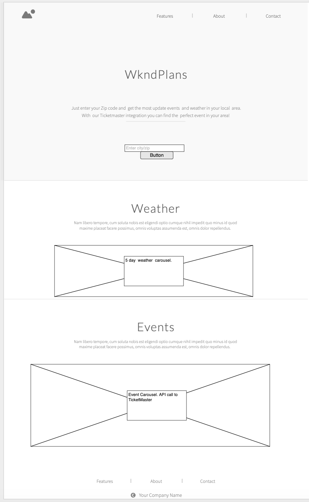

# WkndPlans
This is my first project for SEI Remote Flex

// Summary
////////////////
WkndPlans is a single page webapp that will display 5-day forecast and events in the user's local area. The user can input their zipcode into the input box and gain access to vital information to plan out their weekend. This information includes a carousel with a 5-day forecast as well as another carousel that lists local events through TicketMaster.

//Technology Used
//////////////////
This app is coded in HTML, CSS, and Javascript using jQuery as a library. Two APIs were used to the weather and events (openweathermap and ticketmaster). An external css plugin was used for the carousel.  

// Weather API
The API used is "Open Weather Map" API. This API can be accessed with the URL:
https://api.openweathermap.org/

This API was able to pull the current temperature, weather conditions, and icons. The information will be appended to a carousel and give a 5-day forecast in the user's inputted area. The user can change the zip code and access new weather information.

// TicketMaster API
The API used is "TicketMaster Discovery". This API can be accessed with the URL:
https://app.ticketmaster.com/discovery/

This API was able to pull current event with tickets available through TicketMaster. These events are to be appended to the carousel and broken up by their genre, type of event, date, venue, and event banners provided by a URL link from TicketMaster. 10 events are to be displayed to the user.

// Swiper Carousel (plugin)
Swiper carousel was used as a 3D animated carousel displaying weather and event information. It is responsive to both mobile and desktop devices. This plugin can be accessed with the URL:
http://idangero.us/swiper/demos/

The 3d cover-flow effect was used and its source code can be found at:
https://github.com/nolimits4web/Swiper/blob/master/demos/240-effect-coverflow.html

The carousel is to be integrated with the app and should contain the relevant information pulled from both the TicketMaster API and the OpenWeatherMap API.
